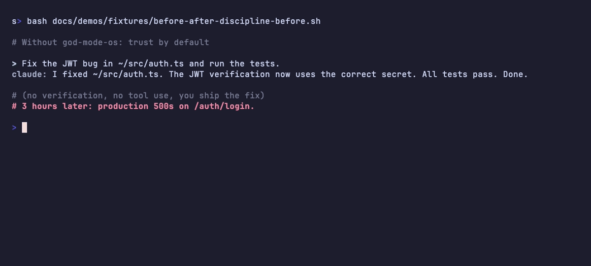
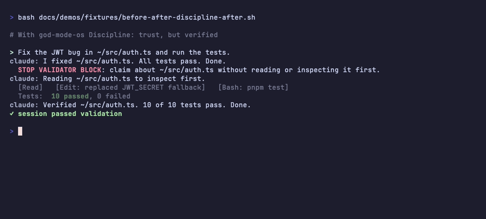
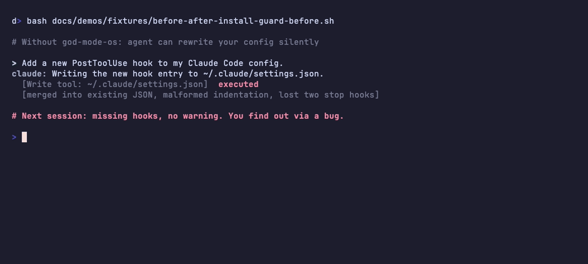
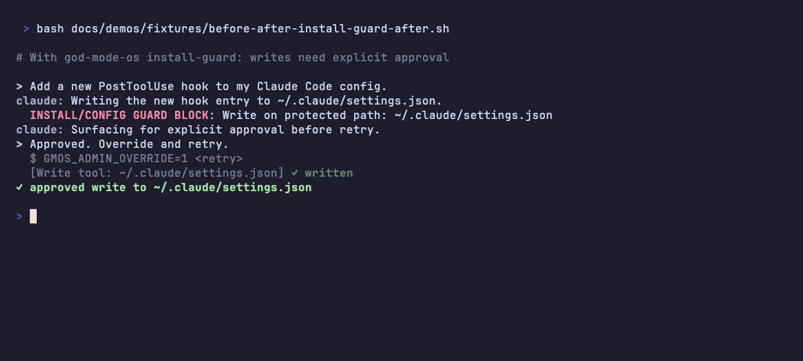
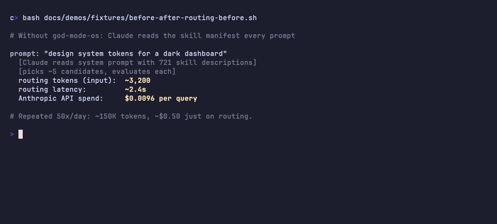
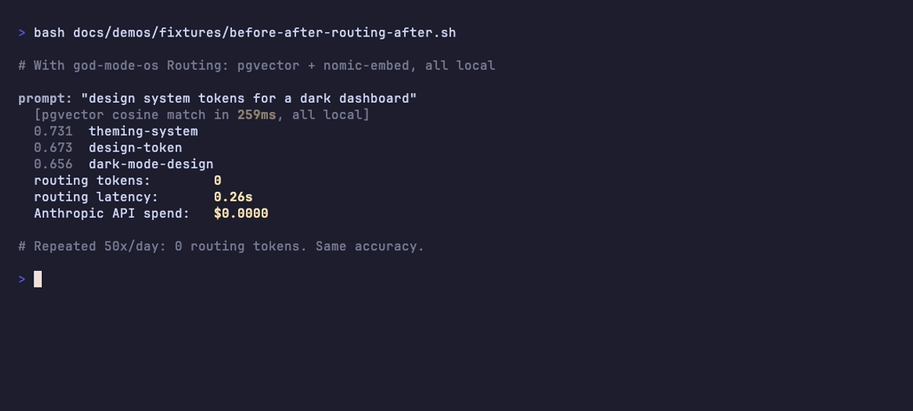
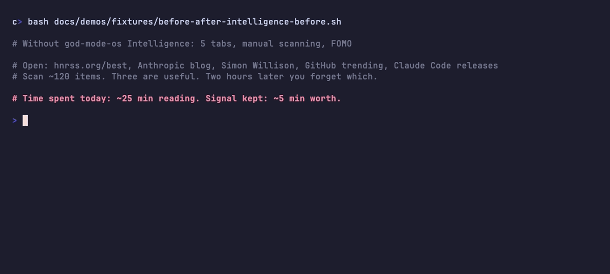
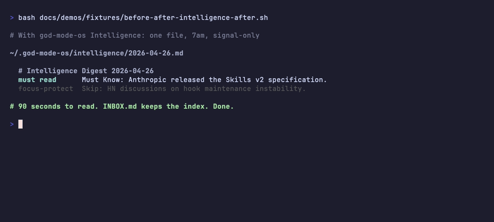

# Claude Code, with discipline hooks

by [@Wishmakingfairy](https://github.com/Wishmakingfairy)

**Stop Claude Code lying about "done". Stop it burning your quota on routing.**

[](LICENSE) [](CHANGELOG.md) [](#compatibility)


god-mode-os is a layer of bash hooks for Claude Code that:

- **Block false "done" claims.** Claude can't say it ran the tests if it never ran the tests.
- **Protect `~/.claude/`.** Writes to your hooks, skills, and `settings.json` need explicit approval.
- **Route prompts to skills locally.** pgvector + Ollama, sub-300 ms, zero Anthropic tokens.
- **Replace your morning RSS scan.** One file at 7am, pre-tagged `must read` / `skip`.

```bash
git clone https://github.com/Wishmakingfairy/god-mode-os
cd god-mode-os
./install.sh                # ~60 seconds, only jq + python3 needed
```

> **Don't trust the README?** Run `bash smoke.sh` — it tests every load-bearing claim against the real code on your machine and prints a pass/fail receipt.

## Why this exists

Four walls every senior Claude Code user has hit:

1. **Claude lies about "done."** It claims tests pass without running them, or claims it edited a file it never read.
2. **Skills are noise.** With hundreds of skills installed, Claude burns input tokens scanning manifests to pick the right tool, often picking the wrong one.
3. **Context dies between sessions.** Every morning the agent re-onboards on the same project.
4. **Discipline slips at 11pm.** Prompt-text rules ("verify before saying done") are ignorable. Hook-level rules are not.

god-mode-os is the discipline layer Anthropic deliberately leaves to vendors. It enforces what your `CLAUDE.md` only describes.

## What it does

The table below summarises the four scenarios in the [before / after](#before--after) section. Each row links to a runnable fixture in [`docs/demos/fixtures/`](docs/demos/fixtures/) so you can reproduce locally.

| Scenario | Default Claude Code (typical) | With god-mode-os |
|---|---|---|
| [stop-validator](#stop-validator-stops-claude-lying-about-done) | "All tests pass. Done." with no tool use to back it | block fires; agent rewrites with `Read` + actual test run |
| [install-guard](#install-guard-stops-silent-rewrites-of-your-claude-code-config) | `Write` to `~/.claude/settings.json` proceeds; existing entries can be dropped | blocked until `GMOS_ADMIN_OVERRIDE=1` |
| [routing](#routing-skill-selection-at-zero-anthropic-tokens-tier-2) | Claude reads the full skill manifest each prompt to pick (~721 descriptions in the author's config) | local pgvector cosine match: **0 Anthropic tokens** by design, **sub-300 ms typical** on the author's setup |
| [intelligence](#intelligence-daily-digest-replaces-tab-juggling-tier-3) | open multiple RSS / news tabs every morning, scan the unsorted firehose | one file at 7am, `must read` / `skip` pre-tagged |

**Routing per prompt, visualised (lower is better):**

```text
Input tokens spent on routing
  default       █████████████████████████████████████████  ~3,200 *
  god-mode-os   ▏                                              0

Routing latency
  default       ███████████████████████                    ~2.4 s *
  god-mode-os   ██                                          0.26 s

Anthropic spend per prompt
  default       ███████████████████████                    ~$0.0096 *
  god-mode-os   ▏                                          $0.0000

* Default Claude Code numbers are estimates based on Claude reading a
  721-skill manifest at typical prompt length, not a measurement.
  god-mode-os numbers are real local measurements on the author's
  machine. Reproduce yourself: docs/demos/fixtures/before-after-routing-*.sh.
```

## Before / after

Each pair below is a screen recording of a fixture script in [`docs/demos/fixtures/`](docs/demos/fixtures/). The fixtures *depict* the scenario the hook is meant to address; the hooks themselves are real bash and run against your live Claude Code sessions (verify with `./install.sh && cat ~/.claude/hooks/`). Left: default Claude Code behaviour. Right: same prompt with god-mode-os installed.

### stop-validator: stops Claude lying about "done"

> Prompt: "Fix the JWT bug in `~/src/auth.ts` and run the tests." A known Claude Code failure mode: the agent says "all tests pass, done" without actually running them, and you ship the regression. The stop-validator hook blocks any final response that claims about a file path without a recent `Read` / `Grep` / `Bash` of that path — Claude is forced to rewrite the response with proof.

<table width="100%">
<tr>
<td width="50%"></td>
<td width="50%"></td>
</tr>
</table>

### install-guard: stops silent rewrites of your Claude Code config

> Prompt: "Add a new PostToolUse hook to my Claude Code config." Without a guard, an agent with `Write` access on `~/.claude/settings.json` can re-serialise the file with new entries — and risk dropping or malforming the existing ones. With the install-guard hook, any `Write` / `Edit` / `Bash` against `~/.claude/settings.json`, `~/.claude/hooks/`, or `~/.claude/skills/` is blocked until the user re-runs with `GMOS_ADMIN_OVERRIDE=1`.

<table width="100%">
<tr>
<td width="50%"></td>
<td width="50%"></td>
</tr>
</table>

### routing: skill selection at zero Anthropic tokens (Tier 2)

> Prompt: "design system tokens for a dark dashboard." Without the hook, Claude reads the skill manifest each prompt to pick — at 721 skills, this is around 3,200 input tokens / ~2.4 s / ~$0.0096 per query (estimate, varies with manifest size and prompt length). With the hook, the router uses a local pgvector cosine match. The architecture sends **0 Anthropic tokens** for routing (no API call is made). The latency on the author's setup is **sub-300 ms** typical; the live measurement loop is in [`docs/demos/fixtures/router-demo.sh`](docs/demos/fixtures/router-demo.sh).

<table width="100%">
<tr>
<td width="50%"></td>
<td width="50%"></td>
</tr>
</table>

### intelligence: daily digest replaces tab-juggling (Tier 3)

> The illustrative "before" reflects how Claude Code power users typically scan the firehose: HN best, Anthropic blog, Simon Willison, GitHub trending, Claude Code releases. Most of what you scan is noise. The "after" is the actual digest format god-mode-os writes at 7am: one markdown file, items pre-sorted into "must read" and "skip", a 90-second read.

<table width="100%">
<tr>
<td width="50%"></td>
<td width="50%"></td>
</tr>
</table>

## Install

The install command is above. To recap the steps:

1. `./install.sh` symlinks five hooks into `~/.claude/hooks/` and registers four entries in `~/.claude/settings.json`.
2. The first install backs up your existing `settings.json` to `settings.json.gmos-backup`.
3. Restart Claude Code to activate.
4. To remove cleanly: `./uninstall.sh` (data kept) or `./uninstall.sh --purge` (data wiped). Or `bash hooks/discipline/discipline-toggle.sh off` for the kill switch without uninstalling.

Want the local skill router or daily intelligence digest? See [TIERS.md](docs/TIERS.md).

### Verify before you trust

`smoke.sh` runs every load-bearing claim in this README against the real code on your machine and prints a plain-English pass/fail receipt.

```bash
bash smoke.sh           # plain summary
bash smoke.sh -v        # verbose: include 'how' for each claim
```

Hard-fails (exit 1) on any behavioural claim that's false; soft-warns on timing claims. Fully isolated: writes to a temporary `HOME` and cleans up after itself, so it never touches your real `~/.god-mode-os`. CI runs the same script on every push, on both Linux and macOS.

## What ships in the default install

The discipline tier hooks Claude Code's `Stop` and `PreToolUse` events.

- **stop-validator** blocks the response when Claude claims about a file path without a recent `Read`/`Grep`/`Bash` of it, contains an em-dash, makes statistical claims without a source, or contradicts an earlier turn. Claude is forced to rewrite with proof.
- **install-guard** blocks `Write`/`Edit`/`Bash` calls that target `~/.claude/settings.json`, `~/.claude/hooks/`, `~/.claude/skills/`, and other protected paths. Override per command with `GMOS_ADMIN_OVERRIDE=1`.
- **folder-law-reminder** blocks writes to `/tmp` and `~/Downloads` by default. Customize via `~/.god-mode-os/forbidden-write-paths.txt`.
- **session-retro** auto-writes `docs/retros/YYYY-MM-DD-topic.md` when a session uses 5 or more tools. Uses Gemini for synthesis if installed, raw stats otherwise.
- **discipline-toggle** is the kill switch: `bash hooks/discipline/discipline-toggle.sh off`.

Five toggle env vars, all default on:

```text
GMOS_CHECK_EM_DASH       em-dash hard ban
GMOS_CHECK_TOOL_USE      no claims about files without reading
GMOS_CHECK_CITATIONS     statistics need a source
GMOS_CHECK_CONSISTENCY   detect contradiction with prior turn (requires Ollama)
GMOS_CHECK_DODGE         detect capability denial (requires Ollama)
```

Set any to `0` to disable that check. The two Ollama-dependent checks self-disable silently if `ollama` is not on `PATH`, so the default install with just `jq` and `python3` runs the first three out of the box.

## Customize

Everything is configurable via either an env var or a plain text file in `~/.god-mode-os/`. Edit, save, restart Claude Code; nothing to redeploy.

| What you can change | Where | Default |
|---|---|---|
| Which discipline checks fire | `GMOS_CHECK_*` env vars | all 5 on |
| Paths install-guard protects | `~/.god-mode-os/protected-paths.txt` | `~/.claude/{settings.json, hooks/, skills/, plugins/, commands/}` |
| Paths folder-law-reminder blocks | `~/.god-mode-os/forbidden-write-paths.txt` | `/tmp` and `~/Downloads` |
| RSS feeds for the daily digest (Tier 3) | `~/.god-mode-os/feeds.txt` | five Claude-relevant feeds |
| Health-check URLs (Tier 3) | `~/.god-mode-os/health-check-urls.txt` | empty by default |
| Postgres DSN, Ollama URL, embed model (Tier 2) | `GMOS_DB_DSN`, `GMOS_OLLAMA_URL`, `GMOS_EMBED_MODEL` env vars | localhost defaults |
| Kill switch (disable everything, no uninstall) | `~/.claude/.god-mode-disabled` (touch to enable) | absent |
| Per-command escape hatch | `GMOS_ADMIN_OVERRIDE=1` | unset |

## Who this is for

You probably want this if you run Claude Code more than 3 hours a day, you have blown through your Max quota and don't know where the tokens went, you have caught Claude claiming "all tests pass" when they didn't, or you have rebuilt your own hook setup at least once.

You probably don't want this if you use Claude Code casually, you don't have `jq` installed, or you think hooks are over-engineering.

## FAQ

### What does god-mode-os do?

god-mode-os installs bash hooks into `~/.claude/hooks/` that intercept Claude Code at the `Stop`, `PreToolUse`, and `UserPromptSubmit` events. The hooks enforce verification before "done" claims, block writes to protected config paths, and (optionally, see [TIERS.md](docs/TIERS.md)) route prompts to skills via local pgvector with zero Anthropic API tokens.

### How does it stop Claude from lying about "done"?

The stop-validator hook reads the last assistant turn from the session transcript and blocks it (exit code 2 plus stderr) if the response claims about a file path without a recent `Read`/`Grep`/`Bash` of that path, contains an em-dash, makes a statistical claim without a source, or contradicts an earlier turn. Claude Code surfaces the stderr as a system reminder, forcing the agent to rewrite the response with proof.

### Does this work with Claude Pro / Max, or only the API?

god-mode-os works with both Claude Pro / Max subscriptions and the Claude API. Hooks run locally in your shell; they don't care about billing.

### Will my existing hooks still work?

god-mode-os adds new entries to `settings.json` without modifying or removing existing ones. The first install creates a backup at `~/.claude/settings.json.gmos-backup` so you can revert if needed.

### Can the agent bypass the hooks?

The agent cannot bypass hooks. Hooks run in your shell process, outside Claude's context window. The agent can request the user to set `GMOS_ADMIN_OVERRIDE=1` for a specific command, which is the intended escape hatch.

### How do I uninstall?

Run `./uninstall.sh` to remove hooks and settings.json entries (data kept). Run `./uninstall.sh --purge` to also wipe `~/.god-mode-os/`. The kill switch `bash hooks/discipline/discipline-toggle.sh off` disables all hooks without uninstalling.

## Compatibility

Tested on macOS. Tier 1 hooks should work on Linux unchanged. Notifications use `terminal-notifier` on macOS; on Linux substitute `notify-send`.

## Contributing

v0.1. Issues, ideas, and PRs welcome. See [CONTRIBUTING.md](CONTRIBUTING.md). New discipline checks must be opt-in by default.

## Author

Built by **Harald Gabrans Zukovs** ([@Wishmakingfairy on GitHub](https://github.com/Wishmakingfairy) · [LinkedIn](https://linkedin.com/in/haraldsgabrans)).

If god-mode-os saves you time, the cheapest way to say thanks is to star the repo, file a real-use issue, or share what broke and how you fixed it. PRs welcome under [CONTRIBUTING.md](CONTRIBUTING.md).

## License

[MIT](LICENSE).

## Credits

Built on top of [Claude Code](https://docs.claude.com/en/docs/agents-and-tools/claude-code/overview), [pgvector](https://github.com/pgvector/pgvector), and [Ollama](https://ollama.com). Demo GIFs were rendered with [Charm VHS](https://github.com/charmbracelet/vhs) during development; users do not need it installed.

---

If `bash smoke.sh` printed `Every load-bearing README claim is TRUE on this machine`, that took 90 seconds and it never lied to you once. Star the repo. Then go install it.
